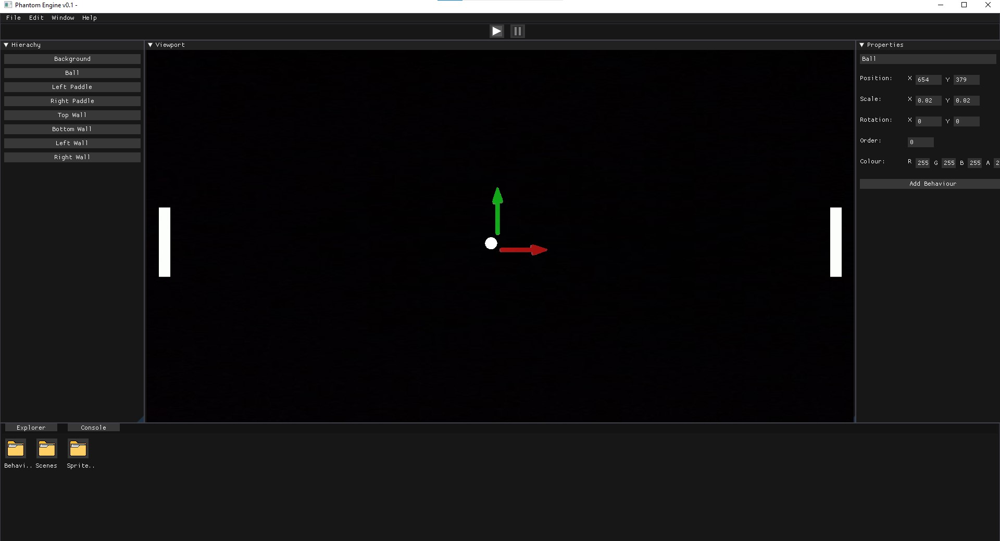

# Phantom Engine
**Important Note: This game engine has been abandoned and its development has moved to [Cryonic Engine](https://github.com/ElectroGamesDev/Cryonic-Engine) with many improvements such as 3D capabilities and build support.**

Phantom Engine is a 2D game engine designed to facilitate game development with a focus on simplicity and flexibility.

## Features

- **2D Rendering:** Powerful 2D rendering capabilities for creating visually appealing games.
- **Scripting Support:** Integrated scripting for easy game logic implementation.
- **Resource Management:** Efficient resource handling for textures, audio, and more.
- **Cross-Platform:** Supports multiple platforms for widespread game deployment.

## Screenshots

## Contributing

This project is no longer actively maintained. However, feel free to fork the repository and continue development on your own.

## License

Phantom Engine is licensed under the [MIT License]([https://github.com/ElectroGamesDev/Phantom-Engine/blob/main/LICENSE])).
